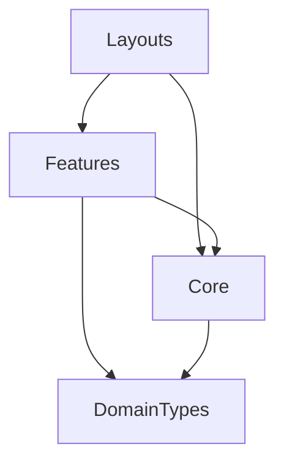

# Architecture Documentation: The Map

> **Philosophy**: Feature-based (Screaming) Architecture.
> **Goal**: The directory structure should scream *what the application does*, not just *what it is built with*.

## 1. Overview & Philosophy

We have transitioned from a generic **Atomic Design** approach to a **Feature-based Architecture**.

### Why change?
Atomic Design sorts code by technical nature (atoms, molecules, organisms), which scatters related business logic across the codebase. As the project grew, adding a feature like "Debts" required touching 5 different folders.

**Feature-based Architecture** groups code by **Business Domain**. Everything related to "Debts" lives in one place. This improves maintainability, scalability, and cognitive load.

## 2. Directory Structure

The codebase is strictly divided into four distinct layers:

```text
src/
├── features/        # THE CORE BUSINESS LOGIC (Domain Driven)
│   ├── auth/        # Authentication domain
│   ├── dashboard/   # Dashboard widgets and logic
│   ├── accounts/    # Bank accounts management
│   ├── debts/       # Debt tracking
│   └── transactions/# Ledger and records
│
├── core/            # SHARED TECHNICAL FOUNDATION (Domain Agnostic)
│   ├── ui/          # Primitive components (Button, Badge)
│   ├── form/        # Form primitives (Input, FileUpload)
│   ├── layout/      # Shell components (Header, Sidebar)
│   └── navigation/  # Navigation logic
│
├── layouts/         # APP COMPOSITION LAYERS
│   └── DashboardLayout.tsx
│
└── types/           # GLOBAL & SHARED TYPES
    ├── domain.ts    # Shared Business Entities (Account, Debt)
    └── enums/       # Global constants
```

## 3. Communication Patterns

### Rules of Engagement
1.  **Features are Independent**: Use strict encapsulation. Feature A should not import deep into Feature B.
    *   *Bad*: `import { .. } from "@features/transactions/components/InternalForm"`
    *   *Good*: `import { TransactionModal } from "@features/transactions"` (Public API)
2.  **Core is Pure**: `@core` components **NEVER** import from `@features`. They are dumb UI bricks.
3.  **One Way Flow**: Features consume Core. Layouts consume Features and Core.

### Visual Dependency Hierarchy



## 4. Aliases (The Glue)

We use Path Aliases to enforce this structure:

- `@features/*`: Direct access to feature modules.
- `@core/*`: Direct access to UI primitives.
- `@domain`: Access to shared business entities.
- `@layouts/*`: Access to page wrappers.
