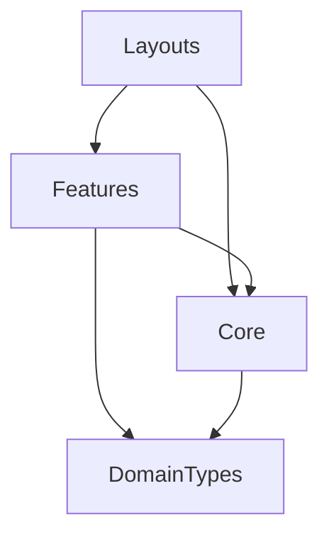

# Documentación de Arquitectura: El Mapa

> **Filosofía**: Arquitectura Basada en Features ("Screaming Architecture").
> **Objetivo**: La estructura de directorios debe gritar _qué hace la aplicación_, no solo _con qué está construida_.

## 1. Visión General y Filosofía

Hemos hecho la transición de un enfoque genérico de **Atomic Design** a una **Arquitectura Basada en Features**.

### ¿Por qué el cambio?

Atomic Design ordena el código por naturaleza técnica (átomos, moléculas, organismos), lo que dispersa la lógica de negocio relacionada por todo el código. A medida que el proyecto crecía, añadir una feature como "Deudas" requiera tocar 5 carpetas diferentes.

La **Arquitectura Basada en Features** agrupa el código por **Dominio de Negocio**. Todo lo relacionado con "Deudas" vive en un solo lugar. Esto mejora la mantenibilidad, escalabilidad y reduce la carga cognitiva.

## 2. Estructura de Directorios

El código base está estrictamente dividido en cuatro capas distintas:

```text
src/
├── features/        # LA LÓGICA DE NEGOCIO (Domain Driven)
│   ├── auth/        # Dominio de autenticación
│   ├── dashboard/   # Widgets y lógica del dashboard
│   ├── accounts/    # Gestión de cuentas bancarias
│   ├── debts/       # Rastreo de deudas
│   └── transactions/# Libro mayor y registros
│
├── core/            # FUNDAMENTOS TÉCNICOS COMPARTIDOS (Agnóstico del Dominio)
│   ├── ui/          # Componentes primitivos (Botón, Badge)
│   ├── form/        # Primitivos de formulario (Input, FileUpload)
│   ├── layout/      # Componentes shell (Header, Sidebar)
│   └── navigation/  # Lógica de navegación
│
├── layouts/         # CAPAS DE COMPOSICIÓN DE APP
│   └── DashboardLayout.tsx
│
└── types/           # TIPOS GLOBALES Y COMPARTIDOS
    ├── domain.ts    # Entidades de Negocio Compartidas (Account, Debt)
    └── enums/       # Constantes globales
```

## 3. Patrones de Comunicación

### Reglas de Combate

1.  **Las Features son Independientes**: Usa encapsulamiento estricto. La Feature A no debe importar profundamente dentro de la Feature B.
    - _Mal_: `import { .. } from "@features/transactions/components/InternalForm"`
    - _Bien_: `import { TransactionModal } from "@features/transactions"` (API Pública)
2.  **Core es Puro**: Los componentes de `@core` **NUNCA** importan de `@features`. Son ladrillos de UI tontos.
3.  **Flujo Unidireccional**: Las Features consumen Core. Los Layouts consumen Features y Core.

### Jerarquía Visual de Dependencias



## 4. Alias (El Pegamento)

Usamos Path Aliases para imponer esta estructura:

- `@features/*`: Acceso directo a módulos de features.
- `@core/*`: Acceso directo a primitivos de UI.
- `@domain`: Acceso a entidades de negocio compartidas.
- `@layouts/*`: Acceso a envoltorios de página.
